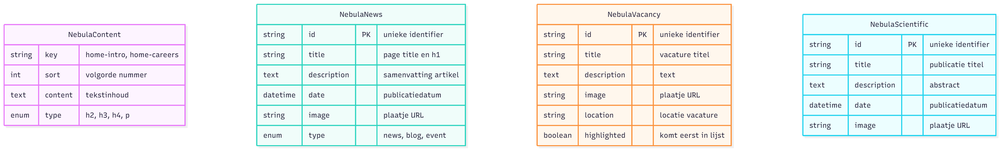

# NEBULA Xplorer - a project by SRON

The NEBULA Xplorer website is a deep source of information on everything to do with the NEBULA Xplorer, a satellite designed to research X-ray binary black holes and their relationships with companion stars over long periods of time. The project as a whole is a combined effort of over 400 students from within the Netherlands.

**Our goals for this project are to build a multi-page website that:**

- helps scientists visualize and interpret complex astronomical data from this mission
- assists engineers with explanations about the technologies of the instrument and satellite
- gives educational and industrial partners the opportunity to showcase themselves
- keeps students connected with each other

**Live link:** [https://nebulaxplorer.dev.fdnd.nl/](https://nebulaxplorer.dev.fdnd.nl/)

## Design

Our designs are based on the [Design Challenge](https://github.com/fdnd-agency/nebulaxplorer/wiki/Design-Challenge) from FDND Agency. You can check out our [Figma prototypes](https://www.figma.com/design/MDGKGDUMzxOx2Ozwp3Mtku/S14--Nebula-explorer?node-id=644-210&p=f&t=OmPcuvANXQAtuUJ0-0) for more designs.

## Pages

The website contains 7 main pages:

- Home
- Mission
- Scientific
- News
- Team
- Assignments
- Partners

Some pages also have detail pages (like news articles, team members, partners, or assignments).

## Features

- **Home Page**

Features recent news articles, an introduction to the project, links to the four "pillars" of the project, and a mailing list sign-up.

- **Mission Page**

Features deeper information on the project, the mission goals, an interactive mission timeline, and testimonials from mission experts.

- **Team Page**

Features teams from over the years. Select any team to view more information about them and what they have to say about their experiences.

- **Assignment Page** 

Fetches all open assignments. Select any to view more details about that assignment.

- **Partners Page**

Features a progressively enhanced carousel that shows off the project's sponsors.

- **News Page** 

Features all the latest news on the project, with nifty pagination.

## Interactive features

- **Scroll rocket animation**

A rocket moves along the page while scrolling.
It shows progress and makes long pages easier to follow.

- **3D Satellite**

A 3D satellite is shown on the website as a visual element.
It helps explain the space mission in a more visual way.

- **Scroll-triggered animations**

We used scroll-triggered animations (GSAP ScrollTrigger) to make the website feel more dynamic.

Elements animate when they enter the viewport while scrolling.

## Datamodel

_Datamodel from Mermaid_

## Installation

This project has been developed in SvelteKit, content is retrieved from Directus CMS, and version control takes place here on GitHub.

Follow the steps below to use this repository for yourself!

1. Clone the repository

`git clone https://github.com/fdnd-agency/nebulaxplorer.git`

`cd nebulaxplorer`

2. Install dependencies

`npm install`

3. Copy the example .env file

`cp .env.example .env`

4. Run the app:

`npm run dev`

Then open the localhost in your browser. All done!

## Licenses

This project is licensed under the terms of the MIT license.
